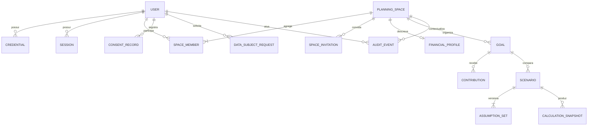

# Modelo de domínio e dados

## Princípios

- IDs externos aleatórios e não sequenciais.
- Dinheiro com decimal exato e código ISO 4217 obrigatório.
- Taxas armazenadas como decimal, nunca percentual formatado.
- Eventos em UTC; datas-alvo como data civil.
- Agregados usam versão para concorrência otimista.
- Snapshots financeiros são imutáveis.
- Exclusão física, anonimização ou retenção depende da finalidade e política aprovada.

## Agregados principais

### User

Identidade da pessoa no produto. Não contém dados de planejamento compartilhado.

Invariantes:

- e-mail normalizado é único;
- estado da conta controla novas sessões;
- credenciais e tokens nunca são expostos ao domínio financeiro.

### PlanningSpace

Fronteira de colaboração e autorização.

Invariantes:

- todo espaço possui ao menos um proprietário ativo;
- espaço pessoal possui exatamente um proprietário;
- convite expira e só pode ser aceito pelo destinatário;
- remoção do último proprietário é proibida;
- alteração de papel não pode deixar o espaço sem proprietário.

### FinancialProfile

Agregado manual e explícito do espaço.

Campos conceituais:

- renda recorrente agregada;
- despesas essenciais agregadas;
- saldo inicial disponível para metas;
- capacidade mensal declarada;
- moeda base;
- data de referência;
- origem do dado (`MANUAL` no MVP).

O sistema pode calcular uma sugestão de capacidade, mas o usuário confirma o valor usado.

### Goal

Representa um objetivo do espaço.

Campos conceituais:

- tipo;
- título;
- valor-alvo;
- base do valor (`CURRENT_VALUE` ou `FIXED_NOMINAL`);
- data-alvo;
- saldo inicial dedicado;
- contribuição planejada;
- moeda;
- estado (`DRAFT`, `ACTIVE`, `PAUSED`, `ACHIEVED`, `ARCHIVED`);
- versão.

Invariantes:

- valor-alvo positivo;
- data-alvo posterior à data-base para projeções futuras;
- moeda consistente entre meta, saldo e contribuições;
- somente metas ativas recebem progresso normal;
- uma meta nunca referencia cenário de outro espaço.

### Scenario

Conjunto versionado de premissas ligado a uma meta. Alterar premissas cria nova versão; não reescreve a anterior.

### CalculationSnapshot

Registro imutável contendo entradas normalizadas, resultado, avisos, versão do motor, versão da fórmula e horário.

### Contribution

Evento financeiro manual que aumenta o saldo acompanhado da meta. Pode ser compartilhado ou atribuído a um membro, sem implicar movimentação bancária real.

## Diagrama relacional conceitual

## Tabelas conceituais

| Tabela | Chaves/restrições críticas |
|---|---|
| `users` | `id`, e-mail normalizado único, estado, timestamps |
| `credentials` | usuário único por tipo, hash, versão, nunca segredo reversível |
| `sessions` | hash do refresh token único, família, expiração, revogação |
| `planning_spaces` | tipo, nome, moeda base, versão |
| `space_members` | único por espaço/usuário, papel, estado |
| `space_invitations` | token em hash, destinatário, papel, expiração, estado |
| `financial_profiles` | único por espaço, data de referência, versão |
| `goals` | espaço, moeda, valor, base, data, estado, versão |
| `contributions` | meta, valor, data, atribuição opcional, idempotency key única no escopo |
| `scenarios` | meta, nome, estado, cenário-base único por meta |
| `assumption_sets` | cenário, versão crescente e conteúdo normalizado |
| `calculation_snapshots` | cenário, versões do motor/fórmula, hash das entradas, saída imutável |
| `consent_records` | usuário, finalidade, versão do texto, decisão, timestamp |
| `data_subject_requests` | usuário, tipo, estado, prazos operacionais |
| `audit_events` | ator, ação, recurso, resultado, metadados mínimos e timestamp |

## Exclusão e histórico

- Metas em rascunho sem histórico relevante podem ser excluídas conforme política.
- Metas com colaboração ou trilha relevante são inicialmente arquivadas e passam pelo fluxo de retenção.
- Snapshots não são atualizados; nova simulação cria novo registro.
- Dados de auditoria são minimizados e protegidos contra alteração.
- A política final de retenção depende do plano LGPD e revisão jurídica.
