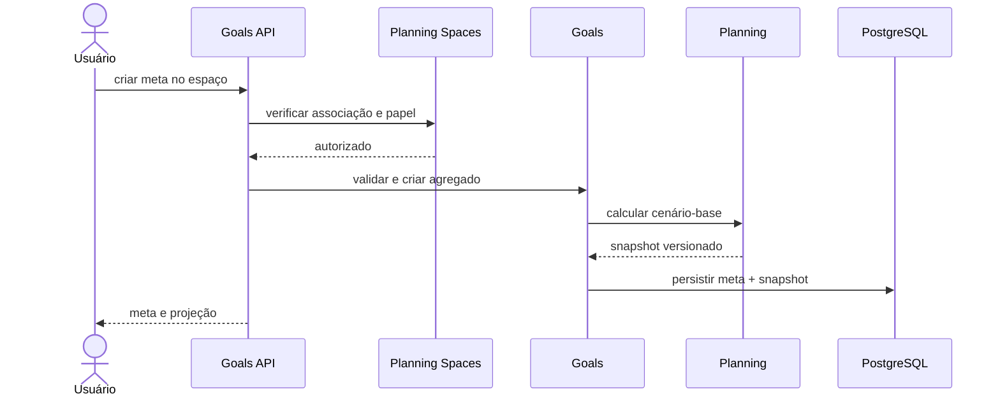

# Módulos e limites de contexto

## Mapa

| Módulo | Responsabilidade | Fonte de verdade | Não faz |
|---|---|---|---|
| `identity` | Conta, credenciais, sessões e recuperação | usuário, credencial, sessão | Não decide acesso a uma meta |
| `planning-spaces` | Espaços pessoais/compartilhados, membros e convites | espaço, associação, convite | Não armazena senha ou calcula projeção |
| `financial-profile` | Entradas manuais compartilháveis usadas no plano | perfil financeiro do espaço | Não importa dados bancários diretamente |
| `goals` | Ciclo de vida e invariantes das metas | meta, participantes e contribuições | Não implementa fórmula financeira |
| `planning` | Goal Engine, Scenario Engine e snapshots | conjuntos de premissas e resultados | Não autoriza usuário ou envia notificação |
| `progress` | Marcos e acompanhamento do realizado | eventos de progresso | Não altera snapshots históricos |
| `privacy-consent` | Consentimentos, exportação e exclusão | consentimento e solicitação do titular | Não interpreta juridicamente a base legal |
| `audit` | Eventos sensíveis e rastreabilidade | trilha append-only | Não recebe segredos nem payloads completos |
| `subscriptions` | Planos e entitlements futuros | assinatura canônica | Não conhece SDK de pagamento |
| `notifications` | Preferências e intenção de comunicação | preferência e entrega canônica | Não conhece SDK do canal |
| `integrations` | Portas canônicas e adaptadores | conexões e sincronizações futuras | Não expõe DTO externo ao domínio |

## Shared kernel

Limitado a conceitos estáveis:

- `UserId`, `PlanningSpaceId`, `GoalId`, `ScenarioId`;
- `Money(amount, currency)`;
- `Percentage` e `AnnualRate`;
- `DateRange`;
- `DomainError` tipado;
- `Clock` e gerador de IDs como portas.

Não colocar services, utilitários genéricos, DTOs ou repositories no shared kernel.

## Espaços de planejamento

`PlanningSpace` é a fronteira de autorização e colaboração.

- `PERSONAL`: criado com a conta e com um único membro proprietário.
- `SHARED`: criado explicitamente e pode possuir dois ou mais membros.

Papéis do MVP:

- `OWNER`: administra membros, configurações e conteúdo;
- `EDITOR`: cria e altera metas, cenários e progresso;
- `VIEWER`: consulta informações autorizadas.

Um espaço pode ter mais de um `OWNER`, permitindo participação equivalente do casal. O convite deve ser aceito pela conta destinatária. Acesso é sempre verificado pela associação ativa ao espaço e pelo papel necessário.

### Privacidade no compartilhamento

- O perfil financeiro pessoal não é copiado automaticamente para o espaço compartilhado.
- O espaço mantém agregados informados conscientemente, como renda conjunta disponível para metas.
- Contribuições podem ser registradas como compartilhadas ou atribuídas a um membro.
- Exportar dados de um membro não inclui dados privados do parceiro.
- Saída ou exclusão de membro exige regra explícita para autoria e atribuição histórica; a decisão jurídica final permanece aberta.

## Fluxo de criação de meta compartilhada

## Eventos internos candidatos

- `UserRegistered`;
- `PlanningSpaceCreated`;
- `MemberInvited`;
- `MemberJoined`;
- `GoalCreated`;
- `GoalChanged`;
- `ContributionRecorded`;
- `ProjectionCalculated`;
- `ConsentChanged`;
- `DataSubjectRequestCreated`.

Eventos descrevem fatos ocorridos, são imutáveis e não substituem transações locais.
