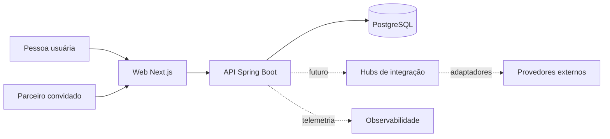
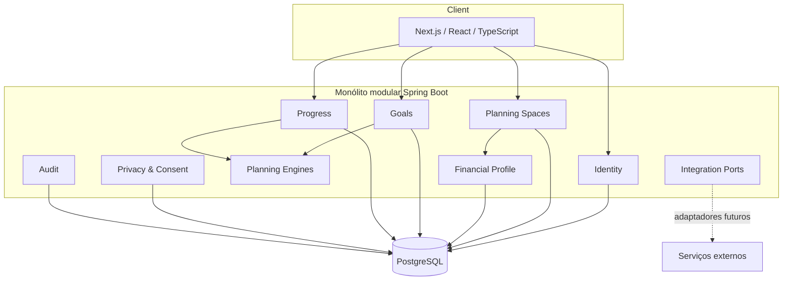

# Arquitetura — visão geral

## Estado

- Fase: 1
- Estado: decisão proposta, aguardando aprovação
- Estilo: monólito modular, orientado a domínio, com portas e adaptadores

## Objetivos arquiteturais

1. Manter regras financeiras independentes de HTTP, banco, frontend e provedores.
2. Isolar dados por espaço de planejamento e aplicar autorização em toda fronteira.
3. Permitir planejamento pessoal e compartilhado por casal no mesmo modelo.
4. Tornar cálculos históricos reproduzíveis.
5. Permitir substituir integrações por adaptadores sem alterar o domínio.
6. Começar simples e extrair processos somente quando medições justificarem.

## Contexto



O navegador nunca é fronteira de segurança. A API autentica, autoriza, valida, executa casos de uso e persiste. O PostgreSQL é a fonte de verdade. Provedores externos são tratados como lentos, falhos e substituíveis.

## Containers lógicos



## Forma de implementação

Cada módulo contém, quando necessário:

```text
module/
  domain/          entidades, value objects, invariantes e eventos
  application/     casos de uso e portas
  adapters/in/     HTTP, jobs e consumidores
  adapters/out/    persistência e provedores
  configuration/   wiring do framework
```

O domínio não depende de Spring, JPA, JSON, OpenAPI ou SDK externo. A camada de aplicação coordena casos de uso por portas. Adaptadores traduzem contratos externos para modelos canônicos.

## Dependências permitidas

- Módulos de negócio podem depender somente do `shared-kernel` pequeno e estável.
- Coordenação entre módulos ocorre por portas de aplicação ou eventos internos explícitos.
- Nenhum módulo consulta diretamente tabelas pertencentes a outro módulo.
- Controllers não acessam repositories diretamente.
- DTOs HTTP não são entidades de domínio.
- Modelos JPA não atravessam o limite do adaptador de persistência.
- Nenhum hub externo é chamado pelo Goal Engine ou Scenario Engine.

## Processamento assíncrono

O MVP não requer broker. E-mails mockados, exportações e cálculos simples podem ser síncronos ou registrados para execução posterior conforme medição. Quando efeitos assíncronos forem introduzidos, usar outbox transacional no PostgreSQL antes de adicionar infraestrutura de fila.

## Consistência e concorrência

- Transações locais por caso de uso.
- `version` para optimistic locking em agregados editáveis.
- `Idempotency-Key` para contribuições, convites, pagamentos e webhooks aplicáveis.
- Constraints do banco como segunda barreira para invariantes.
- Datas em UTC para eventos e `LocalDate` para datas civis de metas.

## Objetivos operacionais iniciais

São metas de engenharia para validação futura, não capacidade comprovada:

- disponibilidade mensal alvo de produção: 99,9%, excluindo manutenção anunciada;
- p95 de leituras e escritas próprias da API: até 500 ms, sem dependências externas;
- p95 de cálculo de uma meta: até 150 ms no ambiente de referência;
- nenhuma perda silenciosa de contribuição confirmada;
- RPO alvo: até 24 horas no beta e posterior redução após medir criticidade;
- RTO alvo: até 4 horas no beta.

As metas devem ser revistas na Fase 7 com testes, custo e infraestrutura reais.

## Evolução

Extração de serviço só será considerada se houver fronteira estável e motivo mensurável, como necessidade independente de escala, disponibilidade, segurança, equipe ou ciclo de deploy. Volume abstrato e “preparação para o futuro” não são motivos suficientes.
