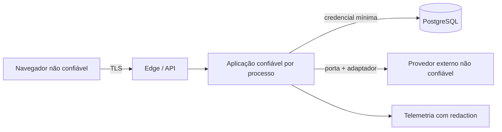

# Threat model inicial

## Escopo

Aplicação web, API, PostgreSQL, sessões, espaços compartilhados, motores de cálculo e futuras integrações. Este documento é um modelo inicial e não substitui avaliação independente.

## Ativos

- identidade e credenciais;
- sessões;
- renda, despesas, patrimônio e metas;
- participação em espaço compartilhado;
- projeções e premissas;
- consentimentos e solicitações do titular;
- trilha de auditoria;
- segredos de infraestrutura e provedores;
- integridade do Goal Engine e dos snapshots.

## Atores

- pessoa usuária legítima;
- parceiro convidado;
- atacante externo;
- usuário autenticado tentando acesso horizontal;
- administrador ou operador indevido;
- provedor comprometido;
- automação abusiva;
- erro de desenvolvimento ou configuração.

## Fronteiras de confiança

Toda entrada do navegador e provedor é não confiável. O frontend melhora a experiência, mas não concede permissão.

## Matriz de ameaças

| ID | Ameaça | Impacto | Probabilidade inicial | Mitigações propostas | Risco residual |
|---|---|---|---|---|---|
| T-001 | Account takeover | Crítico | Média | Argon2id, rate limit, rotação, alertas, MFA futuro | Médio |
| T-002 | IDOR entre espaços | Crítico | Média | autorização por espaço/recurso, queries escopadas, testes negativos | Baixo/médio |
| T-003 | Parceiro mantém acesso após remoção | Alto | Média | revogação de associação, invalidação de cache e teste de sessão | Baixo |
| T-004 | Convite roubado ou encaminhado | Alto | Média | token em hash, expiração, destinatário vinculado e uso único | Baixo/médio |
| T-005 | CSRF altera meta compartilhada | Alto | Média | SameSite, token CSRF, validação de origem | Baixo |
| T-006 | XSS rouba dados exibidos | Alto | Média | encoding, CSP, sanitização, sem tokens no JS | Baixo/médio |
| T-007 | Injeção em banco | Crítico | Baixa/média | ORM parametrizado, validação e testes | Baixo |
| T-008 | Segredo em Git/log | Alto | Média | secret scan, redaction, vault por ambiente | Baixo/médio |
| T-009 | Manipulação de cálculo | Crítico | Média | motor no backend, snapshot com hash/versões, testes independentes | Baixo/médio |
| T-010 | Falsa precisão induz decisão | Alto | Média | premissas visíveis, avisos, testes de compreensão | Médio |
| T-011 | Webhook falso/replay | Alto | Média futura | assinatura, timestamp, idempotência, reconciliação | Baixo/médio |
| T-012 | Exposição por analytics | Alto | Média | allowlist de propriedades e proibição de valores financeiros | Baixo |
| T-013 | Backup acessível ou irrecuperável | Crítico | Baixa/média | criptografia, acesso mínimo, restore testado | Médio até teste |
| T-014 | Abuso de exportação | Alto | Média | reautenticação, rate limit, link curto e auditado | Baixo/médio |
| T-015 | Exclusão apaga dados do parceiro | Alto | Média | separação por espaço, workflow e revisão de impacto | Médio |
| T-016 | SSRF em integração futura | Alto | Baixa/média | destinos allowlisted, egress e validação de URL | Baixo |
| T-017 | Dependência comprometida | Alto | Média | lockfiles, SBOM, scanning, atualização controlada | Médio |
| T-018 | Operador interno consulta dados | Alto | Baixa/média | privilégio mínimo, acesso just-in-time e auditoria | Médio |

## Abuso específico de colaboração

- Convidar e remover repetidamente para assediar alguém.
- Alterar premissas sem que o parceiro perceba.
- Atribuir contribuição financeira falsamente ao outro membro.
- Usar a exportação para obter dados privados do parceiro.
- Excluir ou arquivar meta compartilhada unilateralmente.

Mitigações de produto:

- notificações de mudanças sensíveis;
- histórico de quem alterou o quê;
- atribuição confirmável de contribuições;
- exportação escopada;
- reautenticação para papéis, membros e exclusão;
- possível confirmação conjunta para exclusão definitiva, pendente de validação.

## Controles de plataforma

- TLS e HSTS;
- CSP sem `unsafe-eval` em produção;
- CORS exato;
- headers defensivos;
- containers sem root;
- banco sem exposição pública;
- credenciais separadas por ambiente;
- logs estruturados e minimizados;
- limites de corpo, conexão e timeout;
- dependências e imagens verificadas;
- backup criptografado e restauração exercitada.

## Revisões obrigatórias

Atualizar antes de:

- autenticação real;
- upload;
- conexão Open Finance;
- pagamento;
- canal de notificação real;
- painel administrativo;
- beta e produção.
