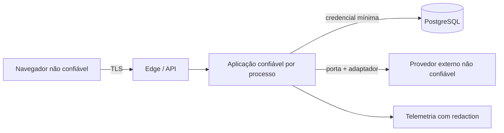

# Threat model inicial

## Escopo

Aplicação web, API, PostgreSQL, sessões, espaços compartilhados, motores de cálculo e futuras integrações. Este documento é um modelo inicial e não substitui avaliação independente.

## Ativos

- identidade e credenciais;
- sessões;
- renda, despesas, patrimônio e metas;
- participação em espaço compartilhado;
- projeções e premissas;
- consentimentos e solicitações do titular;
- trilha de auditoria;
- segredos de infraestrutura e provedores;
- integridade do Goal Engine e dos snapshots.

## Atores

- pessoa usuária legítima;
- parceiro convidado;
- atacante externo;
- usuário autenticado tentando acesso horizontal;
- administrador ou operador indevido;
- provedor comprometido;
- automação abusiva;
- erro de desenvolvimento ou configuração.

## Fronteiras de confiança

Toda entrada do navegador e provedor é não confiável. O frontend melhora a experiência, mas não concede permissão.

## Matriz de ameaças

| ID | Ameaça | Impacto | Probabilidade inicial | Mitigações propostas | Risco residual |
|---|---|---|---|---|---|
| T-001 | Account takeover | Crítico | Média | Argon2id, rate limit distribuído, rotação, alertas, MFA futuro | Médio |
| T-002 | IDOR entre espaços | Crítico | Média | autorização por espaço/recurso, queries escopadas, testes negativos | Baixo/médio |
| T-003 | Parceiro mantém acesso após remoção | Alto | Média | revogação de associação, invalidação de cache e teste de sessão | Baixo |
| T-004 | Identificador de convite observado ou encaminhado | Alto | Média | resposta apenas autenticada, e-mail verificado vinculado, UUID não secreto, bloqueio transacional, expiração e uso único | Baixo/médio |
| T-005 | CSRF altera meta compartilhada | Alto | Média | SameSite, token CSRF, validação de origem | Baixo |
| T-006 | XSS rouba dados exibidos | Alto | Média | encoding, CSP, sanitização, sem tokens no JS | Baixo/médio |
| T-007 | Injeção em banco | Crítico | Baixa/média | ORM parametrizado, validação e testes | Baixo |
| T-008 | Segredo em Git/log | Alto | Média | secret scan, redaction, vault por ambiente | Baixo/médio |
| T-009 | Manipulação de cálculo | Crítico | Média | motor no backend, snapshot com hash/versões, testes independentes | Baixo/médio |
| T-010 | Falsa precisão induz decisão | Alto | Média | premissas visíveis, avisos, testes de compreensão | Médio |
| T-011 | Webhook falso/replay | Alto | Média futura | HMAC antes do parsing, timestamp, idempotência e reconciliação; controles provados no mock | Baixo/médio |
| T-012 | Exposição por analytics | Alto | Média | allowlist de propriedades e proibição de valores financeiros | Baixo |
| T-013 | Backup acessível ou irrecuperável | Crítico | Baixa/média | AES-256-GCM, chave separada, restore V6 isolado testado | Baixo/médio |
| T-014 | Abuso de exportação | Alto | Média | reautenticação, rate limit, link curto e auditado | Baixo/médio |
| T-015 | Exclusão apaga dados do parceiro | Alto | Média | separação por espaço, workflow e revisão de impacto | Médio |
| T-016 | SSRF em integração futura | Alto | Baixa/média | destinos allowlisted, egress e validação de URL | Baixo |
| T-017 | Dependência comprometida | Alto | Média | lockfiles, SBOM Maven, pnpm/OSV na CI e atualização controlada | Baixo/médio |
| T-018 | Operador interno consulta dados | Alto | Baixa/média | privilégio mínimo, acesso just-in-time e auditoria | Médio |
| T-019 | Mensagem de identidade vaza token, destinatário ou permite phishing | Crítico | Média | token opaco de uso único, hash no banco, TLS, origem configurada, remetente validado, sem logs e timeout | Baixo/médio |

## Abuso específico de colaboração

- Convidar e remover repetidamente para assediar alguém.
- Alterar premissas sem que o parceiro perceba.
- Atribuir contribuição financeira falsamente ao outro membro.
- Usar a exportação para obter dados privados do parceiro.
- Excluir ou arquivar meta compartilhada unilateralmente.

Mitigações de produto:

- notificações de mudanças sensíveis;
- histórico de quem alterou o quê;
- atribuição confirmável de contribuições;
- exportação escopada;
- reautenticação para papéis, membros e exclusão;
- possível confirmação conjunta para exclusão definitiva, pendente de validação.

## Controles de plataforma

- TLS e HSTS;
- CSP sem `unsafe-eval` em produção;
- CORS exato;
- headers defensivos;
- containers sem root;
- banco sem exposição pública;
- credenciais separadas por ambiente;
- logs estruturados e minimizados;
- limites de corpo, conexão e timeout;
- dependências e imagens verificadas;
- backup criptografado e restauração exercitada.

## Revisões obrigatórias

Atualizar antes de:

- autenticação real;
- upload;
- conexão Open Finance;
- pagamento;
- canal de notificação real;
- painel administrativo;
- beta e produção.

## Revisão da Fase 7

- O rate limit deixou de depender da memória de uma instância; a chave pseudonimizada expira no PostgreSQL.
- Staging/produção falham no startup com cookies, CORS ou flags inseguros.
- Métricas são técnicas, o endpoint é restrito a loopback e IDs de correlação passam por allowlist.
- Backup criptografado, restauração V6 e rollback do binário foram exercitados sem alterar o banco original.
- SBOM e scanners removeram os achados conhecidos da baseline.

Persistem: fonte de senhas comprometidas, MFA, infraestrutura externa de alertas/cofre, revisão independente e controles de operador antes de dados reais.

## Revisão do canal Resend

- O domínio depende somente de `IdentityMessagePort`; DTO, autenticação e erros do Resend ficam no adaptador.
- O perfil `dev` não expõe a caixa de tokens quando a entrega real está habilitada.
- Remetente rejeita quebras de linha e a configuração externa usa HTTPS.
- Destinatário, token, link e corpo não entram em logs, métricas ou auditoria.
- Entrega síncrona possui timeouts e falha de forma explícita, sem retry cego.

Persistem antes do beta: domínio definitivo com SPF/DKIM/DMARC, monitoramento de bounce/complaint, rotação em cofre, análise contratual do operador e decisão sobre outbox/retry.

## Revisão técnica da Fase 8

- Convites são listados e respondidos somente pela conta autenticada vinculada ao e-mail verificado; o UUID não concede acesso.
- Associação e papel são verificados no backend em cada recurso, com testes negativos de IDOR e escrita por leitor.
- Perfil compartilhado precisa ser criado explicitamente e não copia o perfil pessoal.
- Telemetria usa enums fechados, rejeita propriedades desconhecidas e não aceita valores financeiros ou payload arbitrário.
- A flag do beta é desligada por padrão e o guard atual impede ativação acidental em staging/produção.
- Feedback livre é opcional, curto e acompanhado de aviso, mas ainda demanda retenção, acesso restrito e resposta a incidente.

Persistem: remoção/saída de membro, reautenticação para mudanças críticas de papel, MFA, assédio por múltiplos espaços, revisão jurídica, RIPD, responsáveis, retenção automatizada e validação matemática independente antes de participantes reais.
