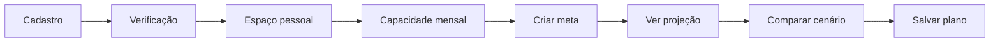
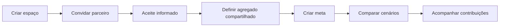
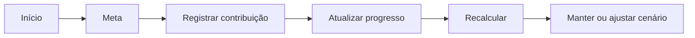

# Mapa de telas e navegação

## Público

```text
/
├── como-funciona
├── privacidade
├── termos
├── entrar
├── cadastro
├── verificar-email
└── recuperar-acesso
```

## Aplicação autenticada

```text
/app
├── inicio
├── onboarding
│   ├── boas-vindas
│   ├── escolher-espaco
│   ├── capacidade
│   └── primeira-meta
├── metas
│   ├── nova
│   └── {goalId}
│       ├── visao-geral
│       ├── cenarios
│       ├── progresso
│       ├── historico
│       └── configuracoes
├── espaco
│   ├── membros
│   ├── convidar
│   └── perfil-financeiro
└── configuracoes
    ├── conta
    ├── aparencia
    ├── notificacoes
    ├── privacidade-e-dados
    └── sessoes
```

## Navegação principal

Desktop:

- logomarca provisória;
- seletor do espaço;
- Início;
- Metas;
- Espaço;
- Configurações.

Mobile:

- topo com contexto do espaço;
- navegação inferior: Início, Metas e Espaço;
- Configurações no menu da conta.

Não duplicar todas as rotas na navegação. Cenários, progresso e histórico pertencem ao contexto de uma meta.

## Fluxos críticos

### Primeira meta pessoal



### Meta compartilhada



### Revisão mensal


